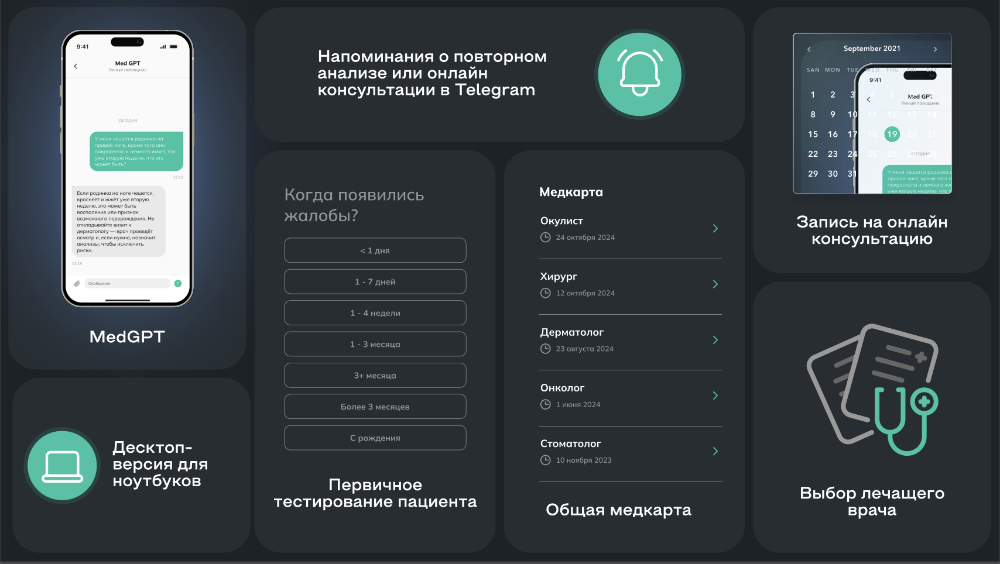

# **Проект: Сервис для Онлайн консультирования пациентов**

## **Описание**
Этот проект представляет собой полностью функционирующий сервис для онлайн консультирования пациентов. Он предназначен для пациентов, врачей любых направлений и медицинских учреждений. Система использует видео конференции для взаимодействия врача и пациента, а также чат бота с искуственным интеллектом.

Проект был создан в рамках **Kazan SmartMed Хакатона**

## **Команда**
1. **Колокольцев Ярослав** (UX/UI Дизайнер): Разрабатывал концепцию пользовательского интерфейса и опыта взаимодействия с сервисом. [Telegram](https://t.me/whatthebooff)
2. **Кичигин Максим** (Frontend-разработчик): Разрабатывал фронтенд веб-приложения, использовал Vue.js. [Telegram](https://t.me/maks_kich)
3. **Уросов Дмитрий** (ML-специалист): Обеспечивал разработку и интеграцию моделей машинного обучения для анализа изображений. [Telegram](https://t.me/dmmmit)
4. **Адзиев Хизри** (Backend-разработчик): Писал API для проекта, создавал базу данных, настраивал Docker файлы и Docker Compose файлы. [Telegram](https://t.me/zhinkinzver)
5. **Каримов Айдар** (ML-специалист): Работал над созданием чат бота с искуственным интеллектом с медицинским промптом, интеграцией моделей машинного обучения для классификации глазных и кожных заболеваний [Telegram](https://t.me/aidarkarimovvw)

## **Технологии**
- **ML**: PyTorch, scikit-learn, Llama3.2 11b, gpt4o, hf transformers
- **BACKEND**: FastAPI, Redis, PostgreSQL, SQLAlchemy, Docker
- **Frontend**: Vue.js PINIA

## **Демонстрация**


## **Как Запустить**

1. **Клонировать репозиторий:**
   ```bash
   git clone https://github.com/qqdzv/Kazan-Hack.git
   ```

2. **Создать файл `.env` и заполнить его с примерными значениями:**
   ```plaintext
   DB_HOST=
   DB_PORT=
   DB_NAME=
   DB_USER=
   DB_PASS=

   REDIS_HOST=
   REDIS_PORT=

   TG_ID_ADMIN=
   TGBOT_TOKEN_ADMIN=
   NOTIFICATIONS_TGBOT_TOKEN=

   SECRET_JWT=
   JWT_ALGORITHM=HS256
   ACCESS_TOKEN_EXPIRE_MINUTES=

   CHAT_BOT_API=
   ```

3. **Запустить проект:**
   ```bash
   docker compose up --build -d
   ```

### **Заключение**

Этот проект важен, так как благодаря нему многие пациенты смогут консультироваться в врачом онлайн, а значит люди чаще будут наблюдаться у специалистов. Что однозначно снизит риск ухудшения состояния пациента, а также поможет выявлять болезни на ранних стадиях. 

## **Лицензия**
- Лицензия: MIT License


